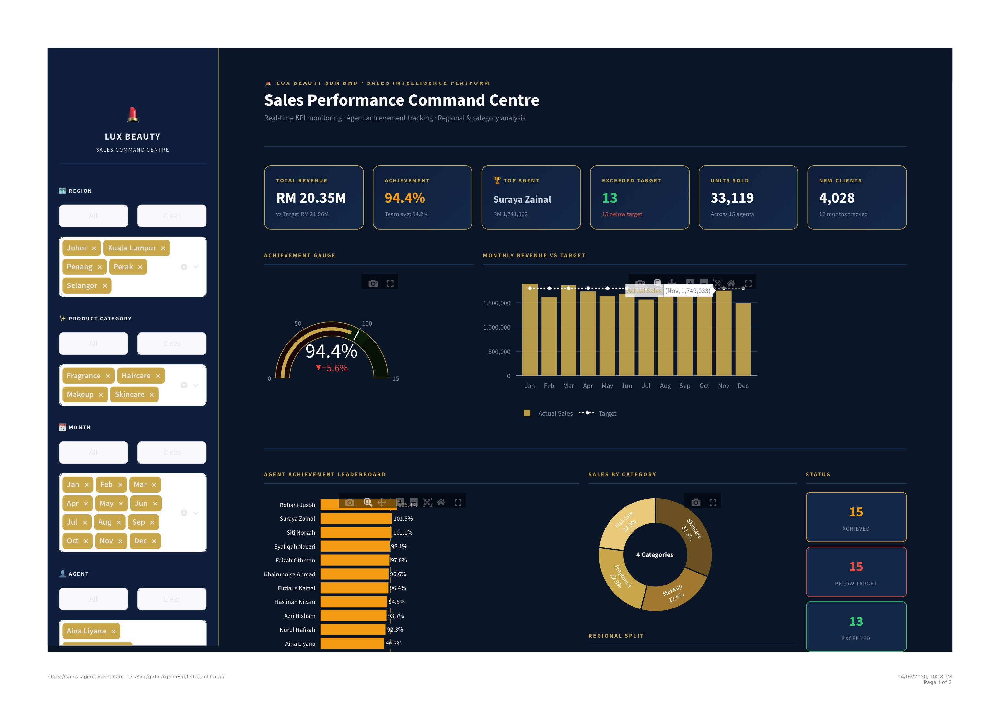

# 💄 LUX Beauty · Sales Performance Command Centre

An end-to-end sales analytics dashboard built with Python, pandas and Streamlit —
tracking KPIs, monthly revenue trends, agent achievement and product category
performance for a fictional beauty & cosmetics company.

🔗 **Live Dashboard:** <https://sales-agent-dashboard-kjss3aazgdtakxqmm8atjl.streamlit.app/>

-----

## 📸 Dashboard Preview



-----

## 📌 Problem Statement

Sales managers need a fast, reliable way to monitor agent performance across regions
and product categories, identify top performers, and flag agents at risk of missing
monthly targets — without manually consolidating spreadsheets every reporting cycle.

This dashboard automates that process: load the data, get instant KPIs, trends and
rankings in one interactive corporate-grade view.

-----

## 🎯 What This Project Does

- Tracks **15 agents** across **5 regions** and **4 product categories** over **12 months**
- Computes KPIs: Total Revenue, Achievement %, Units Sold, New Clients, Conversion Rate
- Flags agents as **Exceeded / Achieved / Below Target**
- Visualises monthly revenue vs target with trend lines
- Achievement gauge showing team performance vs 100% target
- Agent leaderboard colour-coded by performance status
- Sales breakdown by product category (Skincare, Makeup, Fragrance, Haircare)
- Regional contribution analysis
- Exports full agent report as CSV

-----

## 🛠 Tools & Technologies

|Category      |Tools                   |
|--------------|------------------------|
|Language      |Python 3.10             |
|Data Wrangling|pandas, NumPy           |
|Visualisation |Plotly                  |
|Dashboard     |Streamlit               |
|Data          |Anonymised dummy dataset|

-----

## 🔍 Key Insights

- Team overall achievement of **94.4%** against annual target
- **13 agents** exceeded their targets; **15 below target** — signals need for Q3 performance intervention
- **Skincare** is the top-performing category by revenue contribution
- Agents with high client visits but low conversion rate indicate a sales technique gap
- Monthly trend shows consistent performance with slight dip in Q1

-----

## 📁 Repository Structure

```
sales-agent-dashboard/
│
├── app.py                  ← Streamlit dashboard
├── sales_data.csv          ← Anonymised agent dataset (15 agents, 12 months)
├── generate_data.py        ← Script to regenerate dataset
├── requirements.txt        ← Python dependencies
├── images/
│   └── dashboard_preview.jpg
└── README.md
```

-----

## 🚀 How to Run Locally

```bash
git clone https://github.com/Farah-Annisa/sales-agent-dashboard.git
cd sales-agent-dashboard
pip install -r requirements.txt
streamlit run app.py
```

-----

## 🎓 Academic & Professional Context

Built as part of a data analytics portfolio targeting **Data Analyst** and
**Sales Analyst** roles. Inspired by real sales agent management work at
Permodalan Nasional Berhad (PNB).

**Author:** Farah Annisa Binti Norhisham
**Programme:** Master of Data Science, Universiti Malaya
**LinkedIn:** [linkedin.com/in/farah-norhisham-88a3ab390](https://www.linkedin.com/in/farah-norhisham-88a3ab390)
